<<<<<<< HEAD
# Blog App Monorepo

[](https://github.com/username/blog-app/actions/workflows/ci-cd.yml)
[](https://github.com/username/blog-app)
[](https://render.com/deploy?repo=https://github.com/username/blog-app)

A production-ready, full-stack blog platform with GDPR compliance, comprehensive monitoring, and one-click deployment.

## 🚀 Quick Start

**One-click deployment:**
[](https://render.com/deploy?repo=https://github.com/username/blog-app)

**Local development:**
```bash
git clone https://github.com/username/blog-app.git
cd blog-app
npm install
cp .env.example .env  # Fill in your values
npm run dev
```

## Structure

```
├── apps/
│   ├── web/          # Frontend web app (port 3000)
│   ├── admin/        # Admin panel (port 3001)  
│   └── api/          # Backend API (port 4000)
└── packages/
    ├── ui/           # Shared UI components
    └── validations/  # Shared validation schemas
```

## Commands

- `npm run dev` - Start all development servers
- `npm run build` - Build all apps
- `npm run lint` - Lint all packages
- `npm run test` - Run tests for all packages
- `npm run clean` - Clean build artifacts

## Development

1. Copy `.env.example` to `.env` and fill in your values
2. Start services: `docker-compose up -d` (MongoDB, Redis)
3. Start development: `npm run dev`
4. Visit http://localhost:3000 to see "Hello Blog"

## Testing

```bash
# Security audit
cd apps/api && npm run security:audit

# Unit tests
npm test

# E2E tests
cd apps/api && npm run test:e2e

# Load tests (requires k6)
k6 run apps/api/k6/load-test.js
```

## 🏗️ Architecture

```mermaid
graph TB
    subgraph "Frontend"
        Web["🌐 Web App<br/>Next.js + MUI"]
        Admin["⚙️ Admin Panel<br/>React Dashboard"]
    end
    
    subgraph "Backend"
        API["🔧 API Server<br/>Node.js + Express"]
        Auth["🔐 Authentication<br/>JWT + OAuth"]
    end
    
    subgraph "Data Layer"
        MongoDB[("📊 MongoDB Atlas<br/>Primary Database")]
        Redis[("⚡ Redis<br/>Cache + Sessions")]
        S3[("📁 S3 + CloudFront<br/>Static Assets")]
    end
    
    subgraph "Monitoring"
        Prometheus["📈 Prometheus<br/>Metrics Collection"]
        Grafana["📊 Grafana<br/>Dashboards"]
        Sentry["🐛 Sentry<br/>Error Tracking"]
    end
    
    subgraph "Infrastructure"
        ECS["☁️ ECS Fargate<br/>Container Orchestration"]
        ALB["⚖️ Application Load Balancer"]
        VPC["🔒 VPC<br/>Network Isolation"]
    end
    
    Web --> ALB
    Admin --> ALB
    ALB --> API
    API --> Auth
    API --> MongoDB
    API --> Redis
    API --> S3
    API --> Prometheus
    Prometheus --> Grafana
    API --> Sentry
    ECS --> API
    ALB --> ECS
    VPC --> ECS
```



## 🌟 Features

### Core Features
- ✅ **Full-stack blog platform** with posts, comments, media
- ✅ **User authentication** (JWT + Google OAuth)
- ✅ **Admin dashboard** with analytics and moderation
- ✅ **File uploads** with Cloudinary CDN
- ✅ **Email notifications** via SendGrid
- ✅ **3-level comment threading** with moderation
- ✅ **API key management** with scoped permissions

### Performance & UX
- ✅ **Infinite scroll** with IntersectionObserver
- ✅ **Dark/light mode** with system preference detection
- ✅ **Responsive images** with Cloudinary transformations
- ✅ **SEO optimization** with react-helmet-async
- ✅ **Progressive Web App** features

### Security & Compliance
- ✅ **GDPR compliance** with data export/deletion
- ✅ **Security hardening** (Helmet, CORS, rate limiting)
- ✅ **Input sanitization** and validation
- ✅ **JWT secret rotation** for enhanced security
- ✅ **Cookie consent** banner

### DevOps & Monitoring
- ✅ **CI/CD pipeline** with GitHub Actions
- ✅ **Comprehensive testing** (unit, integration, E2E, load)
- ✅ **Infrastructure as Code** with Terraform
- ✅ **Monitoring stack** (Prometheus + Grafana)
- ✅ **Error tracking** with Sentry
- ✅ **Health monitoring** with Uptime Robot

## 📋 API Documentation

- **OpenAPI Spec**: [docs/openapi.json](docs/openapi.json)
- **Postman Collection**: [docs/blog-app-postman-collection.json](docs/blog-app-postman-collection.json)
- **Interactive Docs**: Visit `/api-docs` when running locally

## 🔒 GDPR Compliance

### User Rights
- **Data Export**: `GET /v1/user/export` - Download all user data as ZIP
- **Account Deletion**: `DELETE /v1/user/account` - Schedule deletion (30-day grace period)
- **Data Portability**: Export includes posts, comments, media URLs in JSON format
- **Cookie Consent**: Compliant banner with granular controls

### Legal Documents
- [Privacy Policy](apps/web/public/legal/privacy-policy.md)
- [Terms of Service](apps/web/public/legal/terms-of-service.md)

## 🚀 Deployment Options

### Option 1: One-Click Render Deploy
[](https://render.com/deploy?repo=https://github.com/username/blog-app)

### Option 2: AWS with Terraform
```bash
cd terraform
cp terraform.tfvars.example terraform.tfvars
# Fill in your AWS and MongoDB Atlas credentials
terraform init
terraform apply
```

### Option 3: Docker Compose (Local)
```bash
docker-compose up -d
```

## 📊 Performance Metrics

- **Lighthouse Score**: 90+ (Performance, Accessibility, SEO)
- **Load Test**: 200 RPS with p95 < 500ms
- **Security Audit**: 0 critical vulnerabilities
- **Test Coverage**: 85%+ across all components

## Services

- **Web**: http://localhost:3000 - Main blog frontend
- **Admin**: http://localhost:3001 - Admin panel
- **API**: http://localhost:4000 - Backend API
- **Grafana**: http://localhost:3000 - Monitoring dashboard
- **MongoDB**: localhost:27017
- **Redis**: localhost:6379
=======
# Modern Blog Application

A full-stack blog application built with React, Node.js, Express, and MongoDB.

## Features

### Authentication & Account Management
- ✅ User registration and login with JWT
- ✅ Password hashing with bcrypt
- ✅ Remember me functionality
- ✅ Password change and account deletion

### User Profile
- ✅ Personal information management
- ✅ Profile image upload (JPG/PNG, 5MB limit)
- ✅ Social media links integration
- ✅ User statistics (posts, followers, following)

### Blog Management
- ✅ Create, read, update, delete blogs
- ✅ Markdown editor with live preview
- ✅ Draft system with auto-save
- ✅ Tag system for categorization
- ✅ Word count and reading time calculation

### Social Features
- ✅ Like/unlike blog posts
- ✅ Comment system
- ✅ Follow/unfollow users
- ✅ Real-time notifications

### External API
- ✅ RESTful API with authentication
- ✅ API key generation (OpenAI-style)
- ✅ CRUD operations for blogs

## Tech Stack

**Frontend:**
- React 18
- React Router v6
- Tailwind CSS
- Axios
- React Markdown
- SimpleMDE Editor

**Backend:**
- Node.js
- Express
- MongoDB with Mongoose
- JWT Authentication
- Bcrypt
- Multer (file uploads)

## Installation

### Prerequisites
- Node.js (v14 or higher)
- MongoDB (local or Atlas)

### Backend Setup

1. Navigate to backend directory:
```bash
cd backend
```

2. Install dependencies:
```bash
npm install
```

3. Configure environment variables in `.env`:
```
PORT=5000
MONGODB_URI=mongodb://localhost:27017/modern-blog
JWT_SECRET=your-super-secret-jwt-key-change-this-in-production
JWT_EXPIRE=7d
NODE_ENV=development
```

4. Start MongoDB (if running locally):
```bash
mongod
```

5. Start backend server:
```bash
npm run dev
```

Backend will run on `http://localhost:5000`

### Frontend Setup

1. Navigate to frontend directory:
```bash
cd frontend
```

2. Install dependencies:
```bash
npm install
```

3. Start React development server:
```bash
npm start
```

Frontend will run on `http://localhost:3000`

## API Endpoints

### Authentication
- `POST /api/auth/register` - Register new user
- `POST /api/auth/login` - Login user
- `GET /api/auth/me` - Get current user

### Users
- `GET /api/users/profile/:id?` - Get user profile
- `PUT /api/users/profile` - Update profile
- `POST /api/users/profile/image` - Upload profile image
- `DELETE /api/users/profile/image` - Remove profile image
- `PUT /api/users/password` - Change password
- `DELETE /api/users/account` - Delete account
- `POST /api/users/api-keys` - Generate API key
- `GET /api/users/api-keys` - Get API keys
- `DELETE /api/users/api-keys/:keyId` - Revoke API key

### Blogs
- `POST /api/blogs` - Create blog
- `GET /api/blogs` - Get all blogs
- `GET /api/blogs/:id` - Get single blog
- `PUT /api/blogs/:id` - Update blog
- `DELETE /api/blogs/:id` - Delete blog
- `POST /api/blogs/:id/like` - Like/unlike blog

### Comments
- `POST /api/comments/:blogId` - Create comment
- `GET /api/comments/:blogId` - Get comments
- `DELETE /api/comments/:id` - Delete comment

### Social
- `POST /api/social/follow/:userId` - Follow/unfollow user
- `GET /api/social/notifications` - Get notifications
- `PUT /api/social/notifications/:id/read` - Mark as read
- `PUT /api/social/notifications/read-all` - Mark all as read
- `DELETE /api/social/notifications` - Clear all notifications

### External API (requires API key)
- `GET /api/external/blogs` - Get all blogs
- `GET /api/external/blogs/:id` - Get single blog
- `POST /api/external/blogs` - Create blog (authenticated)
- `PUT /api/external/blogs/:id` - Update blog (authenticated)
- `DELETE /api/external/blogs/:id` - Delete blog (authenticated)

## Usage

1. Register a new account or login
2. Create your first blog post with markdown
3. Like and comment on other users' posts
4. Follow users to see their content
5. Manage your profile and settings
6. Generate API keys for external access

## Project Structure

```
modern-blog/
├── backend/
│   ├── controllers/
│   ├── middleware/
│   ├── models/
│   ├── routes/
│   ├── utils/
│   ├── uploads/
│   └── server.js
├── frontend/
│   ├── public/
│   ├── src/
│   │   ├── components/
│   │   ├── context/
│   │   ├── pages/
│   │   ├── services/
│   │   ├── App.js
│   │   └── index.js
│   └── package.json
└── README.md
```

## Security Features

- Password hashing with bcrypt
- JWT token authentication
- API key authentication for external access
- Input validation and sanitization
- File upload validation
- Protected routes

## Contributing

Feel free to submit issues and pull requests!

## License

MIT License
>>>>>>> 8527b540 (first commit new blog)
